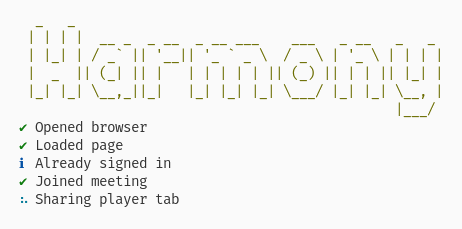

<div align="center">
    
    <h1>Harmony</h1>
    <p>
        <b>Listen to music on Google Meet! 🎥</b>
    </p>
    <p>
        
        
        
        
    </p>
    <br>
    <br>
    <br>
</div>

## Setup

You will need the following binaries on your PATH:

- [`node` (v20)](https://nodejs.org/en/download/prebuilt-installer)
- [`yt-dlp`](https://github.com/yt-dlp/yt-dlp#installation)

Optionally, install `chromium` and set `PUPPETEER_EXECUTABLE_PATH` to its binary.

If you have [Nix](https://nixos.org/) and [Flakes](https://nixos.wiki/wiki/Flakes) run

```sh
 # If you have direnv
direnv allow

# Otherwise
nix develop
```

Once you have the system dependencies, run

```sh
npm i
```

## Usage

To run Harmony, run the start script with three arguments:
- `--url <meeting url>`
- `--email <email (google account)>`
- `--password <password (google account)>`

Example:

```sh
npm run start -- --url https://meet.google.com/xxx-xxxx-xxx --email harmony@gmail.com --password abcd12345
```

## Screenshot


